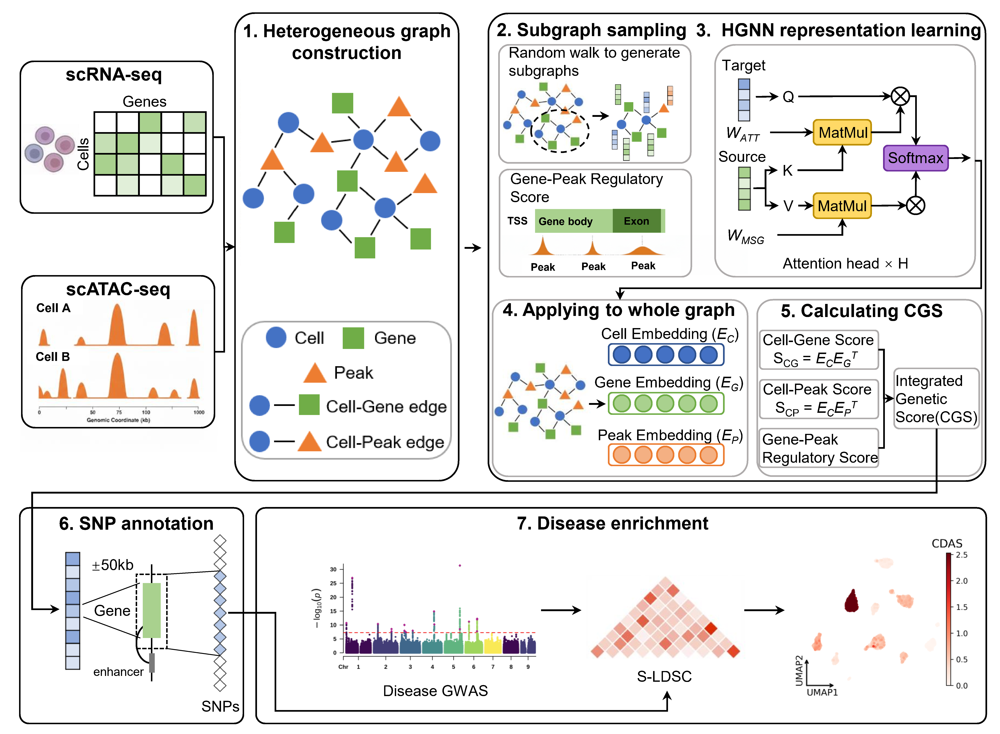

# scMOGS: a cross-modality attention heterogeneous graph neural network integrating single-cell multi-omics data for elucidating cell-disease association 
scMOGS is a model that integrates single-cell multi-omics data with GWAS summary statistics for evaluating variant impact on cells and disease-cell associations.

## Installation

To reproduce **scMOGS**, we suggest first creating a conda environment by:

~~~shell
conda create -n scMOGS python=3.9
conda activate scMOGS
~~~

and then run the following code to install the required package:

~~~shell
cd scMOGS-master
pip install -r requirements.txt
~~~

### Requirements
- `numpy==1.22.3`
- `pandas==1.5.3`
- `anndata==0.8.0`
- `matplotlib==3.5.1`
- `scipy==1.9.1`
- `seaborn==0.11.2`
- `scikit-learn==1.1.2`
- `torch==2.4.1`
- `torch-geometric==2.1.0.post1`
- `torchmetrics==0.9.3`
- `tqdm==4.64.0`
- `scanpy==1.9.1`
- `torch_sparse==0.6.18`
- `torch_scatter==2.1.2`
- `leidenalg==0.10.2`
- `pyarrow==17.0.0`

## Data preparation
* `Gene_Cell.mtx`: scRNA-seq count matrix. Stored in a sparse matrix format, detailing the gene expression levels across cells (Rows: Genes, Columns: Cells).
* `Peak_Cell.mtx`: scATAC-seq count matrix. Stored in a sparse matrix format, representing the signal intensity or raw counts of each chromatin accessibility region (Peak) across individual cells (Rows: Peaks, Columns: Cells).
* `Gene_Peak.mtx`: Gene-Peak association matrix. Describes the structural prior relationships between genes and peaks. Please refer to the process in scMOGS/Gene_Peak_Calculation.R
* `Cell_names.tsv`: Cell name list.
* `Gene_names.tsv`: Gene name list.
* `Peak_names.tsv`: Peak name list.

Data format see Data_example

## HGNN training
The train_model.py script train a Heterogeneous Graph Neural Network (HGNN) to integrate single-cell multi-omics data and output embedding for cell, gene and peak.
~~~shell
python train_model.py \
  --lr 0.0005 \
  --labsm 0.1 \
  --wd 0.1 \
  --nlayers 3 \
  --n_hid 128 \
  --nheads 8 \
  --neighbor 20 \
  --cell_size 50 \
  --epochs_p1 100 \
  --epochs_p2 50 \
  --device 0 \
  --input_file <path_to_your_input_directory> \
  --output_file <path_to_output_directory_of_embedding>
~~~
* `--lr`: Learning rate.
* `--labsm`: The rate of LabelSmoothing.
* `--wd`: Weight decay.
* `--nlayers`: The number of graph convolution layers.
* `--n_hid`: The dimensionality of embeddings.
* `--nheads`: The number of parallel attention heads within the multi-head attention module.
* `--neighbor`: The number of neighboring nodes to be selected for each cell in the subgraph.
* `--cell_size`: The number of cells per subgraph (batch).
* `--epochs_p1`: The epoch number of MultimodalFeatureEncoder.
* `--epochs_p2`: The epoch number of IntegratedOmicTrainer.
* `--device`: GPU device ID to use.
* `--input_file`: Path to the input dataset directory.
* `--output_file`: Path to the directory where the embeddings will be saved.

## CGS calculating
The compute_score.py script calculates the cell-gene interaction score using the embedding of cells, genes and peaks.
~~~shell
python compute_score.py \
  --input_file <path_to_your_input_directory> \
  --embedding_file <path_to_output_directory_of_embedding> \
  --output_file <path_to_output_directory_of_score_matrix> \
  --species human \
  --homologs_path <path_to_homologs_path>
~~~
* `--input_file`: Path to the input dataset directory.
* `--embedding_file`: Path to the directory where the embeddings is saved.
* `--output_file`: Path to the directory where the score matrix will be saved.
* `--species`: human or mouse.
* `--homologs_path`: Path to the a homologous transformation file for converting the gene names. Default: ./scMOGS/mouse_human_homologs.txt

## Disease enrichment
To evaluate the association between cells and diseases, we employ the S-LDSC method implemented in gsMap.

Please ensure you have installed gsMap and downloaded the required genome references (e.g., 1000 Genomes reference panel) and your GWAS summary statistics. For detailed installation and preparation instructions, please refer to the [gsMap Official Documentation](https://yanglab.westlake.edu.cn/gsmap/document/software).

### Generate ldscore
~~~shell
for CHROM in {1..22}
do
    gsmap run_generate_ldscore \
        --workdir <path_to_output_directory_of_score_matrix> \
        --sample_name <sample_name> \
        --chrom $CHROM \
        --bfile_root 'gsMap_resource/LD_Reference_Panel/1000G_EUR_Phase3_plink/1000G.EUR.QC' \
        --keep_snp_root 'gsMap_resource/LDSC_resource/hapmap3_snps/hm' \
        --gtf_annotation_file 'gsMap_resource/genome_annotation/gtf/gencode.v46lift37.basic.annotation.gtf' \
        --gene_window_size 50000
done
~~~

### S-LDSC
~~~shell
gsmap run_spatial_ldsc \
    --workdir <path_to_output_directory_of_score_matrix> \
    --sample_name <sample_name> \
    --trait_name <disease_name> \
    --sumstats_file <path_to_GWAS_sumstats.gz> \
    --w_file 'gsMap_resource/LDSC_resource/weights_hm3_no_hla/weights.' \
    --num_processes 4
~~~

